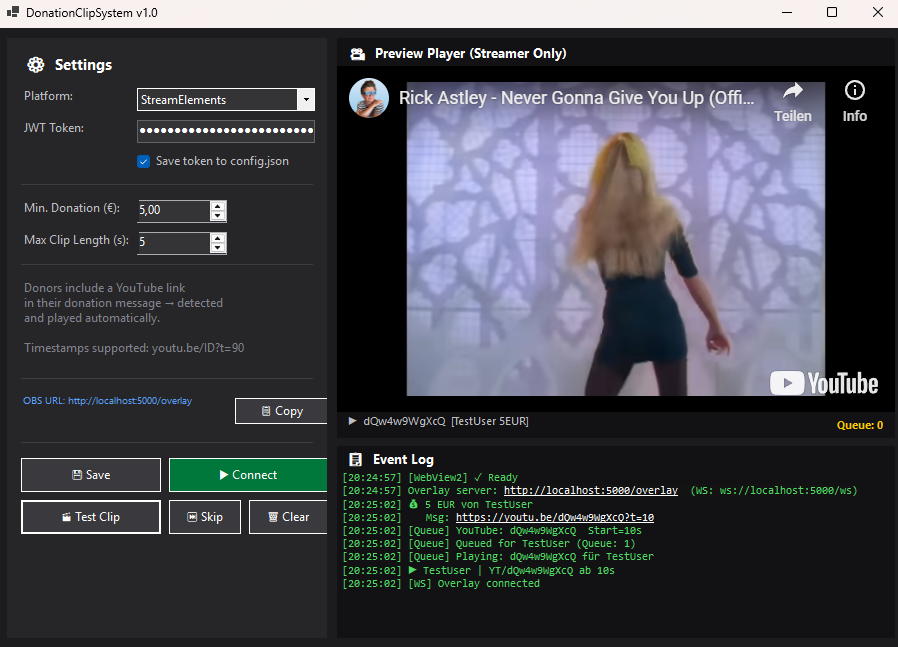
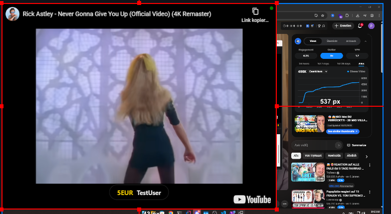

# DonationClipSystem

A C# WinForms application for streamers that monitors donations from **StreamElements** or **Tipestream** and automatically plays YouTube clips — both in OBS (via a browser source overlay) and in a local streamer preview window.

---

## Preview





---

## Requirements

| Component | Version |
|---|---|
| .NET SDK | 8.0 or later |
| Windows | 10 / 11 |
| WebView2 Runtime | Included in Windows 11 / [Download](https://developer.microsoft.com/en-us/microsoft-edge/webview2/) |
| OBS Studio | Any recent version |

---

## Setup

### 1. Build

```bash
cd DonationClipSystem
dotnet restore
dotnet build -c Release
```

### 2. Run

```
dotnet run
```

### 3. Configure

| Setting | Description |
|---|---|
| Platform | StreamElements or Tipestream |
| JWT Token / API Key | Your platform token |
| Save Token | Tick to persist token in `config.json` |
| Min. Donation | Minimum amount that triggers a clip |
| Max Clip Length | How many seconds of the clip to play |

### 4. Add OBS Browser Source

1. In OBS, add a **Browser Source**
2. Set URL to: `http://localhost:5000/overlay`
3. Set width/height to your stream resolution (e.g. 1920×1080)
4. Tick **Refresh browser when scene becomes active**

---

## How it works

Donors include a YouTube link in their donation message. The app detects it automatically and plays the clip — in OBS for viewers, and in the preview player for the streamer.

**Preview player is muted** — audio plays only in the OBS overlay.

---

## Getting API Tokens

### StreamElements
1. Log in at [streamelements.com](https://streamelements.com)
2. Click your avatar (top right) → select your channel
3. Toggle **Show Secrets**
4. Copy your **JWT Token**

### Tipestream
1. Log in at [tipeeestream.com](https://tipeeestream.com)
2. Dashboard → **API Key**
3. Copy your API key

---

## YouTube URL Support

| Format | Start time |
|---|---|
| `https://youtu.be/abc123` | 0s |
| `https://youtu.be/abc123?t=45` | 45s |
| `https://youtu.be/abc123?t=1m30s` | 90s |
| `https://youtube.com/watch?v=abc123&t=1h2m3s` | 3723s |

---

## Donation Queue

Multiple donations are queued and played back-to-back. Use **⏭ Skip** to skip the current clip or **🗑 Clear** to empty the queue.

---

## Architecture

```
DonationClipSystem (WinForms)
│
├── OverlayServer
│   ├── HTTP  → http://localhost:5000/overlay   (overlay.html + player.html)
│   └── WS    → ws://localhost:5000/ws          (play/stop events to OBS)
│
├── StreamElementsService
│   ├── wss://astro.streamelements.com          (real donations)
│   └── wss://realtime.streamelements.com       (test/emulate events)
│
├── TipestreamService
│   └── Socket.IO via dynamic host from API
│
├── ClipQueueService        ← Queue + playback timing
│
└── MainForm
    └── WebView2            ← Local preview (muted) + YouTube IFrame API
```

---

## config.json

```json
{
  "platform": "StreamElements",
  "token": "YOUR_JWT_HERE",
  "saveToken": true,
  "minDonation": 5.0,
  "maxVideoLength": 30,
  "overlayPort": 5000,
  "wsPort": 5001
}
```

---

## NuGet Packages

| Package | Purpose |
|---|---|
| `Microsoft.Web.WebView2` | YouTube playback in preview |
| `Newtonsoft.Json` | JSON config |
| `Websocket.Client` | StreamElements / Tipestream WS |

---

## Troubleshooting

**Overlay blank in OBS** → Make sure the app is running before OBS loads the browser source. Check port 5000 is not blocked.

**WebView2 error on startup** → Install the [WebView2 Runtime](https://developer.microsoft.com/en-us/microsoft-edge/webview2/).

**StreamElements not receiving events** → Double-check your JWT token. The app connects to both the Astro gateway (real donations) and the legacy realtime endpoint (test/emulate).

**Tipestream not connecting** → Use your API Key from the dashboard, not your login password.
